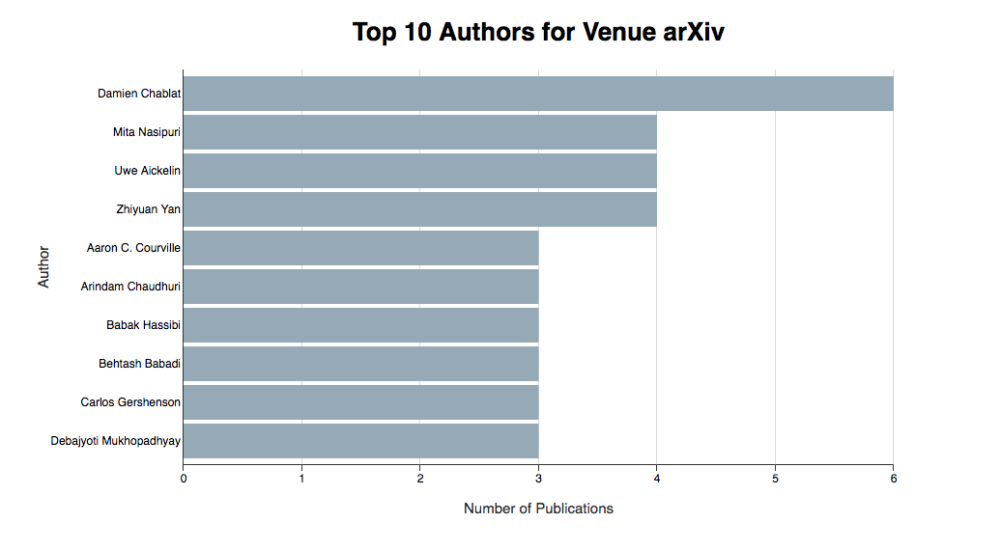

# CS3219 D3 Visualization

## Set Up

1. Open the terminal
1. Navigate to the folder 'cs3219-d3'
1. Enter the command 'python -m SimpleHTTPServer 8080'
1. Open your browser and go to 'localhost:8080'
1. Click the respective page you want to view


# Assignment 4: CIR (Viz)

Code Repository URL:<br>
Front end: [[https://github.com/AngShiYa/cs3219-d3](https://github.com/AngShiYa/cs3219-d3)]<br>
Back end: [[https://github.com/IanTeo/cs3219-Project](https://github.com/IanTeo/cs3219-Project)]


Name | Matriculation Number | Feature Implemented
----|----|----|
Ang Shi Ya | A0138601M | d3
Ian Teo | A0139930B | Query & d3
Yong Zhi Yuan | A0139655U | Model & Tests

## 1. Introduction


## 2. Visualization - Purpose & Method

No. | Task | Visualization
---|------|-----|
1 | Top 10 Authors for Venue arXiv | Horizontal Bar Chart
2 | Top 5 Papers for Venue arXiv | Vertical Bar Chart
3 | Publication Trend for Venue ICSE | Dot Plot
4 | Citation Web for 'Low-density parity check codes over GF(q)' | Force-Directed Graph
5 | Words Frequency of Paper Titles | Word Cloud

### Task 1 - Top 10 Authors for Venue arXiv
<p align="center">
<br>

<em>Figure 1: Top 10 Authors for Venue arXiv based on publications made across all available years </em>
</p>

Barchart was chosen for this task because it is useful for displaying comparative and ordinal data. Since there are quite a few number of authors to visualise, we have decided to use horizontal bars which works well with the top down reading pattern of the human eyes. The top down flow also makes it easier to convey ordered data, which in this case the longer bars are displayed on top of the shorter ones.

#### Steps

**1. Import d3.js**

Since we will be using D3 to create the charts, we will first need to import the javascript files from D3.

```
<script src="d3.v3.min.js"></script>
```

**2. Create a `<div>` as a container for the chart elements**

Next, we will need a container for the chart. We will also be adding the axes, axes label and chart title into this container.

```
<div id="barchart"></div>
```

**3. Set up SVG**

Before we can add a SVG, we will first have to declare the dimensions and margins for the SVG.

```javascript
var margin = {top: 80, right: 25, bottom: 60, left: 200},
	width = 960 - margin.left - margin.right,
	height = 550 - margin.top - margin.bottom;
```

We can now append a SVG using the following code.

```javascript
var chart = d3.select("#barchart")
	.append("svg")
	.attr("width", width + margin.left + margin.right)
	.attr("height", height + margin.top + margin.bottom)
	.append("g")
	.attr("transform", "translate(" + margin.left + "," + margin.top + ")");
```

**4. Set up x and y scales**

As we will need the chart to scale accordingly to the data, we will first grab the data. In this case since our API returns a json, we will be getting the data from the json file.

```javascript
d3.json("arxiv-top-authors.json", function(data) {
	\\ codes
});
```	

>  This json file has the following format:<br>
> `[{"name": "author name", "paperCount" : 3} ... ]`

We can now define the scales inside the call back.

```javascript
var x = d3.scale.linear()
	.range([0, width])
	.domain([0, d3.max(data, function(d) { return d.paperCount; })]);

var y = d3.scale.ordinal()
	.rangeRoundBands([height, 0], .1)
	.domain(data.map(function(d) { return d.name; }));
```

**5. Define x axis and y axis**

Using `d3.svg.axis()` we will be able to define the number of ticks, the display format and the orientation of the axis.

```javascript
var xAxis = d3.svg.axis()
	.ticks(d3.max(data, function(d) { return d.paperCount; }))
   	.tickFormat(d3.format(".0f"))
   	.scale(x)
   	.orient("bottom");

var yAxis = d3.svg.axis()
   	.scale(y)
   	.tickSize(0)
   	.orient("left");
```

**6. Add chart elements (axes, axes label, bars and chart title)**

Now that all the setting up is done, we can finally add the respective chart elements. There is no concept of z-index for SVG, so we will have to take note of the order of the elements that we are adding (since the earlier elements will be 'painted' over by newer elements).

First we will add the grid lines for x axis. We want the grid line to appear behind the bars, so this has to be added before the bars.

```javascript
chart.append("g")
	.attr("class", "grid")
   	.attr("transform", "translate(0, " + height + ")")
   	.call(xAxis.tickSize(-height, 0, 0).tickFormat(""));
```

Next, we will add the bars. The bars have to be added before the axes so that the edges of the bars does not cover the axes.

```javascript
var bar = chart.selectAll(".bar")
	.data(data)
   	.enter()
   	.append("g")

bar.append("rect")
	.attr("class", "bar")
	.attr("x", 0)
	.attr("width", function(d) { return x(d.paperCount); })
	.attr("y", function(d) { return y(d.name); })
	.attr("height", y.rangeBand());
```

Now we can add the axes and its label.

```javascript
// Add x axis
chart.append("g")
	.attr("class", "x axis")
   	.attr("transform", "translate(0, " + height + ")")
   	.call(xAxis);

// Add x axis label
chart.append("text")
	.attr("text-anchor", "middle")
  	.attr("transform", "translate(" + width/2 + ", " + (height + 50) + ")")
   	.attr("class", "label")
  	.text("Number of Publications");
            
// Add y axis
chart.append("g")
	.attr("class", "y axis")
   	.call(yAxis)
   	.append("text");

// Add y axis label
chart.append("text")
   	.attr("text-anchor", "middle")
   	.attr("transform", "translate("+ (0 - (margin.left/2 + 40)) + "," + (height/2) +")rotate(-90)")
   	.attr("class", "label")
   	.text("Author");      
```

Finally, we will add the chart title.

```javascript
chart.append("text")
	.attr("text-anchor", "middle")
 	.attr("transform", "translate(" + width/2 + ", " + (0 - (margin.top/2) + 10) + ")")
  	.attr("class", "charttitle")
  	.text("Top 10 Authors for Venue arXiv");
```

**7. Add tooltip**

After creating the basic barchart, we can add tooltip to enhance the interactivity of the chart. We will be doing it using d3.tip.js, so first we would have to import the javascript file.

```
<script src="d3.tip.js"></script>
```

Next, we will need to add the styling for the tooltip. This is where you can edit the CSS to achieve the look and feel you want for the tooltip.

```
.d3-tip {
	line-height: 1;
   	font: 14px sans-serif;
   	padding: 12px;
   	background: rgba(0, 0, 0, 0.8);
   color: rgb(185, 185, 185);
 	border-radius: 2px;
}

/* Creates a small triangle extender for the tooltip */
.d3-tip:after {
	box-sizing: border-box;
   	display: inline;
   	font-size: 10px;
   	width: 100%;
   	line-height: 1;
   	color: rgba(0, 0, 0, 0.8);
   	content: "\25BC";
  	position: absolute;
   	text-align: center;
}

.d3-tip.n:after {
	margin: -1px 0 0 0;
   	top: 100%;
   	left: 0;
}
```

Now we need to add the javascript codes to display the tip dynamically.

```javascript
var tip = d3.tip()
	.attr('class', 'd3-tip')
   	.offset([-10, 0])
   	.html(function(d) {
   		return "<div><span>Name:</span> <span style='color:white'>" + d.name + "</span></div>" + "<div><span>Total Publications:</span> <span style='color:white'>" + d.paperCount + "</span></div>";
    })

chart.call(tip);
```

Finally, for the javascript code to be called, we need to add the mouseover and mouseout event to the bars.

```javascript
bar.append("rect")
	.attr("class", "bar")
	.attr("x", 0)
	.attr("width", function(d) { return x(d.paperCount); })
	.attr("y", function(d) { return y(d.name); })
	.attr("height", y.rangeBand())
   	.on("mouseover", tip.show) // NEW
  	.on("mouseout", tip.hide); //NEW
```

### Task 2 - Top 5 Papers for Venue arXiv

### Task 3 - Publication Trend for Venue ICSE

### Task 4 - Citation Web for 'Low-density parity check codes over GF(q)'

### Task 5 - Words Frequency of Paper Titles


## 3. Other Information
