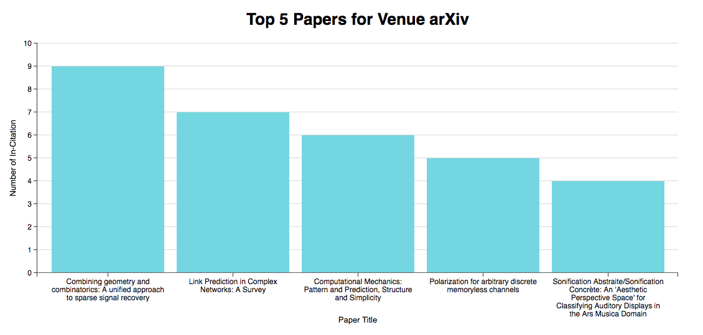
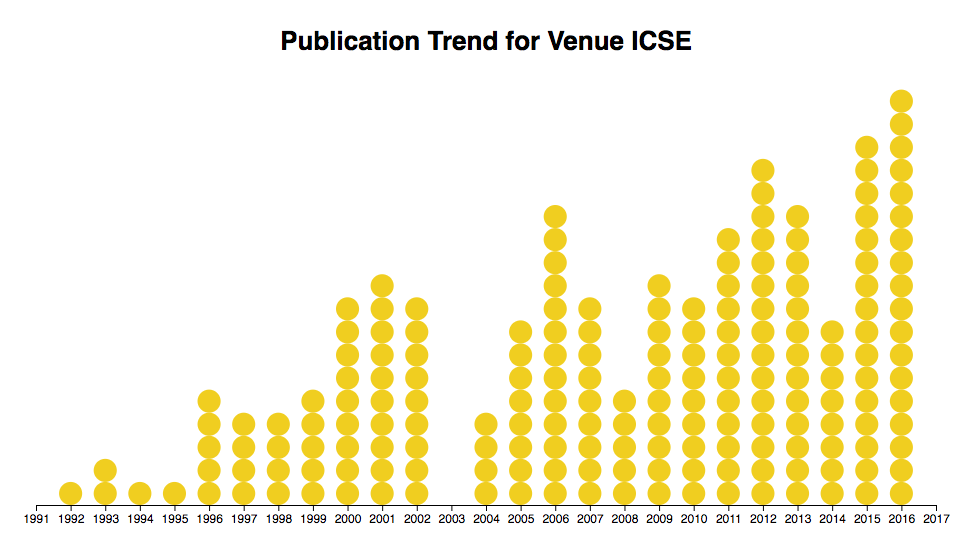
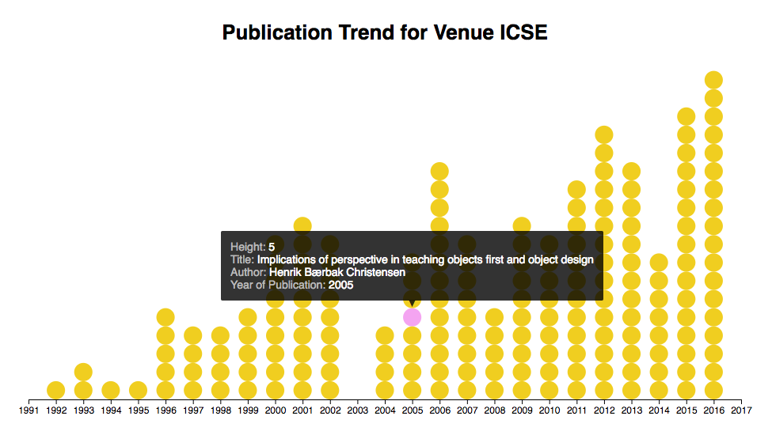
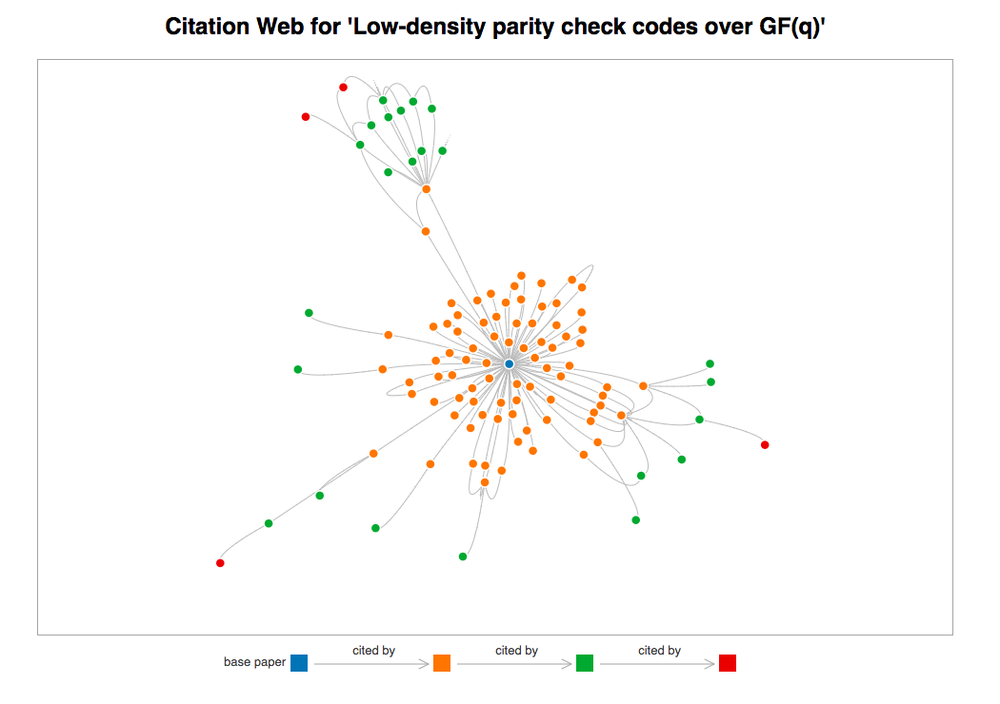
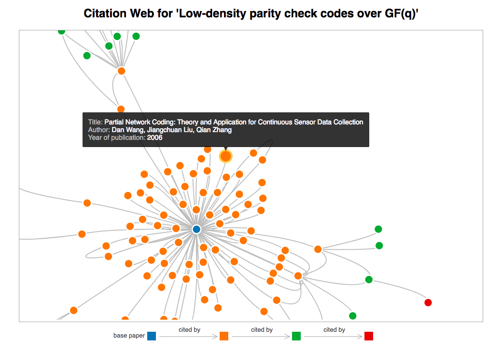
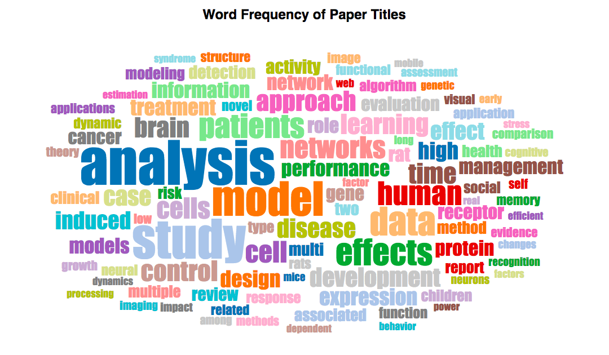

# CS3219 D3 Visualization

## Set Up

1. Open the terminal
1. Navigate to the folder 'cs3219-d3'
1. Enter the command 'python -m SimpleHTTPServer 8080'
1. Open your browser and go to 'localhost:8080'
1. Click the respective page you want to view


# Assignment 4: CIR (Viz)

Code Repository URL:<br>
Front end: [[https://github.com/AngShiYa/cs3219-d3](https://github.com/AngShiYa/cs3219-d3)]<br>
Back end: [[https://github.com/IanTeo/cs3219-Project](https://github.com/IanTeo/cs3219-Project)]


Name | Matriculation Number | Feature Implemented
----|----|----|
Ang Shi Ya | A0138601M | d3
Ian Teo | A0139930B | Query & d3
Yong Zhi Yuan | A0139655U | Model & Tests

## 1. Introduction

For this assignment, we used the first 200,000 lines of the dataset from [http://labs.semanticscholar.org/corpus/](http://labs.semanticscholar.org/corpus/) to plot 5 visualizations. We parsed the data using the same model that we used in Assignment 3, and used d3.js to visualize the data on a website. The parser returns a JSON file based on the query, which is read by the website to plot the respective visualizations.

## 2. Visualization - Purpose & Method

No. | Task | Visualization
---|------|-----|
1 | Top 10 Authors for Venue arXiv | Horizontal Bar Chart
2 | Top 5 Papers for Venue arXiv | Vertical Bar Chart
3 | Publication Trend for Venue ICSE | Dot Plot
4 | Citation Web for 'Low-density parity check codes over GF(q)' | Force-Directed Graph
5 | Words Frequency of Paper Titles | Word Cloud

### Task 1 - Top 10 Authors for Venue arXiv
<p align="center">
<br>

<em>Figure 1: Top 10 Authors for Venue arXiv based on publications made across all available years</em>
</p>

Barchart was chosen for this task because it is useful for displaying comparative and ordinal data. Since there are quite a few number of authors to visualize, we have decided to use horizontal bars which works well with the top down reading pattern of the human eyes. The top down flow also makes it easier to convey ordered data, which in this case the longer bars are displayed on top of the shorter ones.


### Task 2 - Top 5 Papers for Venue arXiv

<p align="center">
<br>

<em>Figure 2: Top 5 Papers for Venue arXiv based on number of in citations</em>
</p>

This task is similar to the previous task, except that we want the top 5 papers instead of top 10 authors. Similarly, a barchart works best for displaying this comparative data.

### Task 3 - Publication Trend for Venue ICSE

<p align="center">
<br>

<em>Figure 3: Trend of publications made for Venue ICSE across all available years</em>
</p>

We chose to use dot plot to visualize the publication trend as the data was relatively small, and we could visualize every single paper on the chart, while still showing the overall trend using this chart. In addition, this visualization allows us to detect any gaps or anomaly in the data quickly.

<p align="center">
<br>

<em>Figure 3: Publication trend with tooltip</em>
</p>

In order to show the additional data, such as paper title, authors and year, we used a tooltip to display the data on mouse over.

### Task 4 - Citation Web for 'Low-density parity check codes over GF(q)'

<p align="center">
<br>

<em>Figure 4: Citation web for base paper 'Low-density parity check codes over GF(q)'</em>
</p>

The best way to visualize a citation web would be to use a force-directed graph, where each node represents papers and each edge is a citation.

<p align="center">
<br>

<em>Figure 5: Citation web with tooltip</em>
</p>

It is not possible to show the details of each paper without cluttering the visualization. Therefore, we decided to add the following enhancements:

- Tooltips on mouseover to show more detailed information related to the paper, such as title, authors and year.
- Zoom in/out to show certain areas of interest more clearly.
- Show the citation relationship in the legend. Different colors represent different levels of citation, such as blue for the base paper and orange for the papers that directly cite the base paper.


### Task 5 - Word Frequency of Paper Titles

<p align="center">
<br>

<em>Figure 4: Word frequency of paper titles</em>
</p>

We wanted to provide a broader view of the data for this task, as the previous tasks all showed data specific to a certain title or venue. To give a complete view of the dataset we are using, we decided to do a word cloud to show the popular topics amongst the papers in our dataset.

A word cloud enables us to quickly identify words that are repeated many times in the titles of all the papers, showing us the popular topics amongst all the papers.

For example, from this visualization, we can see that neurology (**brain, receptor, neurons**) and biology (**cells, gene, disease**) are popular topics to write papers on, in our dataset.

We can also see that words like **analysis, study and model** are used frequently, but we believe that it is because papers are always related to at least one of these research types.

### Steps to Create Visualization

This guide shows how to create the most basic visualization, a barchart. We will be using Task 1 as the example. Other visualizations should follow similar steps.

**1. Get json file for relevant data**

Before we start creating the visualization, we need to obtain a json file representing the data we want to visualize. For this project, the data is parsed in the back end to get a json file.

>  The json file has the following format:<br>
> `[{"name": "author name", "paperCount" : 3}, ... ]`

**1. Import d3.js**

Since we will be using D3 to create the charts, we will first need to import the javascript files from D3.

```
<script src="d3.v3.min.js"></script>
```

**2. Create a `<div>` as a container for the chart elements**

Next, we will need a container for the chart. We will also be adding the axes, axes label and chart title into this container.

```
<div id="barchart"></div>
```

**3. Set up SVG**

Before we can add a SVG, we will first have to declare the dimensions and margins for the SVG.

```javascript
var margin = {top: 80, right: 25, bottom: 60, left: 200},
    width = 960 - margin.left - margin.right,
    height = 550 - margin.top - margin.bottom;
```

We can now append a SVG using the following code.

```javascript
var chart = d3.select("#barchart")
    .append("svg")
    .attr("width", width + margin.left + margin.right)
    .attr("height", height + margin.top + margin.bottom)
    .append("g")
    .attr("transform", "translate(" + margin.left + "," + margin.top + ")");
```

**4. Set up x and y scales**

As we will need the chart to scale accordingly to the data, we will first grab the data. In this case since our API returns a json, we will be getting the data from the json file.

```javascript
d3.json("arxiv-top-authors.json", function(data) {
    \\ codes
});
```	

We can now define the scales inside the call back.

```javascript
var x = d3.scale.linear()
    .range([0, width])
    .domain([0, d3.max(data, function(d) { return d.paperCount; })]);

var y = d3.scale.ordinal()
    .rangeRoundBands([height, 0], .1)
    .domain(data.map(function(d) { return d.name; }));
```

**5. Define x axis and y axis**

Using `d3.svg.axis()` we will be able to define the number of ticks, the display format and the orientation of the axis.

```javascript
var xAxis = d3.svg.axis()
    .ticks(d3.max(data, function(d) { return d.paperCount; }))
    .tickFormat(d3.format(".0f"))
    .scale(x)
    .orient("bottom");

var yAxis = d3.svg.axis()
    .scale(y)
    .tickSize(0)
    .orient("left");
```

**6. Add chart elements (axes, axes label, bars and chart title)**

Now that all the setting up is done, we can finally add the respective chart elements. There is no concept of z-index for SVG, so we will have to take note of the order of the elements that we are adding (since the earlier elements will be 'painted' over by newer elements).

First we will add the grid lines for x axis. We want the grid line to appear behind the bars, so this has to be added before the bars.

```javascript
chart.append("g")
    .attr("class", "grid")
    .attr("transform", "translate(0, " + height + ")")
    .call(xAxis.tickSize(-height, 0, 0).tickFormat(""));
```

Next, we will add the bars. The bars have to be added before the axes so that the edges of the bars does not cover the axes.

```javascript
var bar = chart.selectAll(".bar")
    .data(data)
    .enter()
    .append("g")

bar.append("rect")
    .attr("class", "bar")
    .attr("x", 0)
    .attr("width", function(d) { return x(d.paperCount); })
    .attr("y", function(d) { return y(d.name); })
    .attr("height", y.rangeBand());
```

Now we can add the axes and its label.

```javascript
// Add x axis
chart.append("g")
    .attr("class", "x axis")
    .attr("transform", "translate(0, " + height + ")")
    .call(xAxis);

// Add x axis label
chart.append("text")
    .attr("text-anchor", "middle")
    .attr("transform", "translate(" + width/2 + ", " + (height + 50) + ")")
    .attr("class", "label")
    .text("Number of Publications");
            
// Add y axis
chart.append("g")
    .attr("class", "y axis")
    .call(yAxis)
    .append("text");

// Add y axis label
chart.append("text")
    .attr("text-anchor", "middle")
    .attr("transform", "translate("+ (0 - (margin.left/2 + 40)) + "," + (height/2) +")rotate(-90)")
    .attr("class", "label")
    .text("Author");      
```

Finally, we will add the chart title.

```javascript
chart.append("text")
    .attr("text-anchor", "middle")
    .attr("transform", "translate(" + width/2 + ", " + (0 - (margin.top/2) + 10) + ")")
    .attr("class", "charttitle")
    .text("Top 10 Authors for Venue arXiv");
```

**7. Add tooltip**

After creating the basic barchart, we can add tooltip to enhance the interactivity of the chart. We will be doing it using d3.tip.js, so first we would have to import the javascript file.

```
<script src="d3.tip.js"></script>
```

Next, we will need to add the styling for the tooltip. This is where you can edit the CSS to achieve the look and feel you want for the tooltip.

```
.d3-tip {
    line-height: 1;
    font: 14px sans-serif;
    padding: 12px;
    background: rgba(0, 0, 0, 0.8);
    color: rgb(185, 185, 185);
    border-radius: 2px;
}

/* Creates a small triangle extender for the tooltip */
.d3-tip:after {
	box-sizing: border-box;
   	display: inline;
   	font-size: 10px;
   	width: 100%;
   	line-height: 1;
   	color: rgba(0, 0, 0, 0.8);
   	content: "\25BC";
  	position: absolute;
   	text-align: center;
}

.d3-tip.n:after {
    margin: -1px 0 0 0;
    top: 100%;
    left: 0;
}
```

Now we need to add the javascript codes to display the tip dynamically.

```javascript
var tip = d3.tip()
    .attr('class', 'd3-tip')
    .offset([-10, 0])
    .html(function(d) {
        return "<div><span>Name: </span><span style='color:white'>" + d.name + "</span></div>"
         + "<div><span>Total Publications: </span><span style='color:white'>" + d.paperCount + "</span></div>";
    })

chart.call(tip);
```

Finally, for the javascript code to be called, we need to add the mouseover and mouseout event to the bars.

```javascript
bar.append("rect")
    .attr("class", "bar")
    .attr("x", 0)
    .attr("width", function(d) { return x(d.paperCount); })
    .attr("y", function(d) { return y(d.name); })
    .attr("height", y.rangeBand())
    .on("mouseover", tip.show) // NEW
    .on("mouseout", tip.hide); //NEW
```


## 3. Other Information

### Data Source
